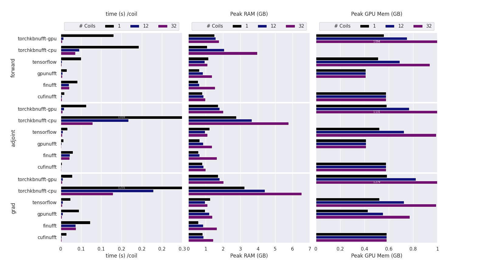
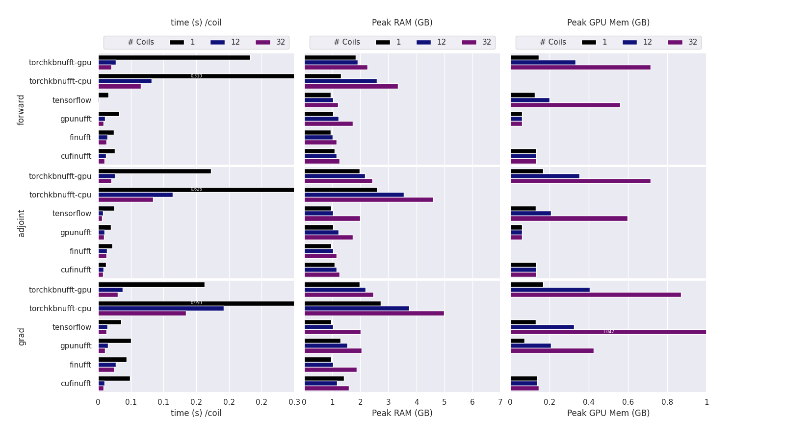
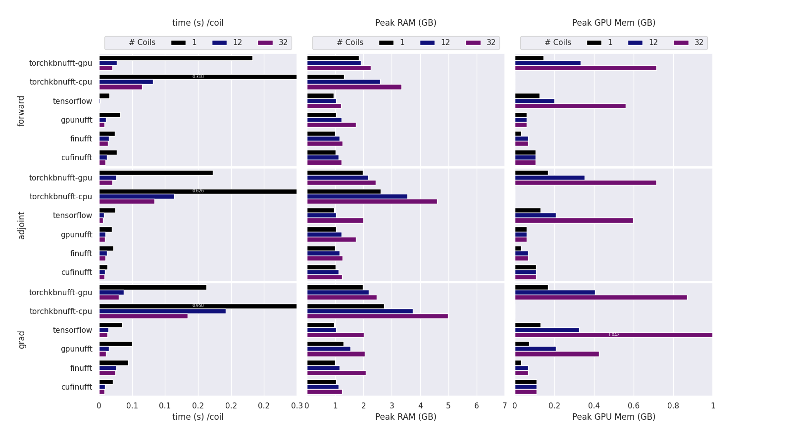
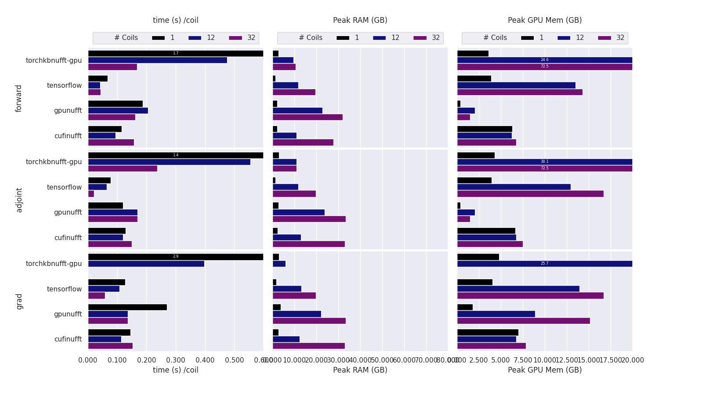
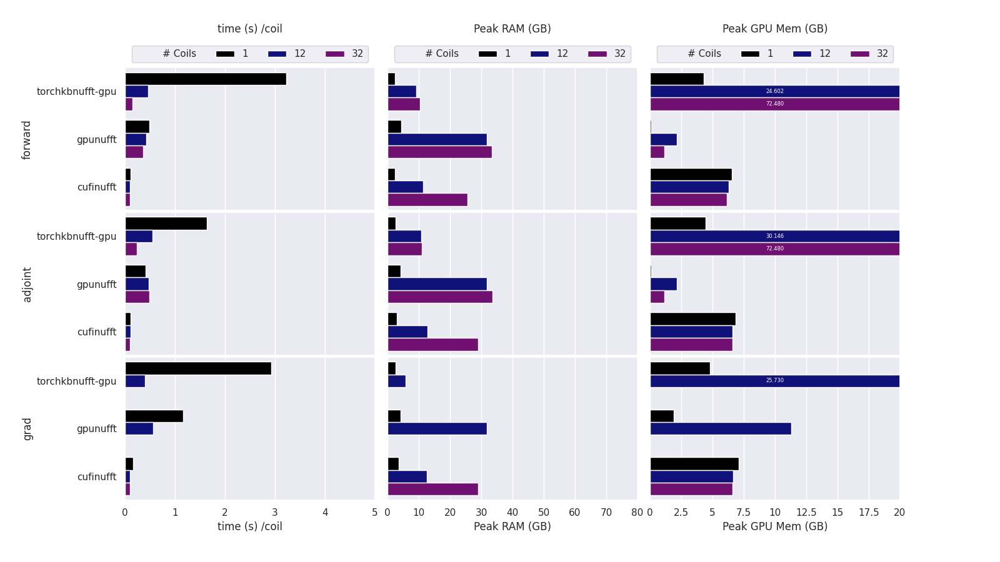
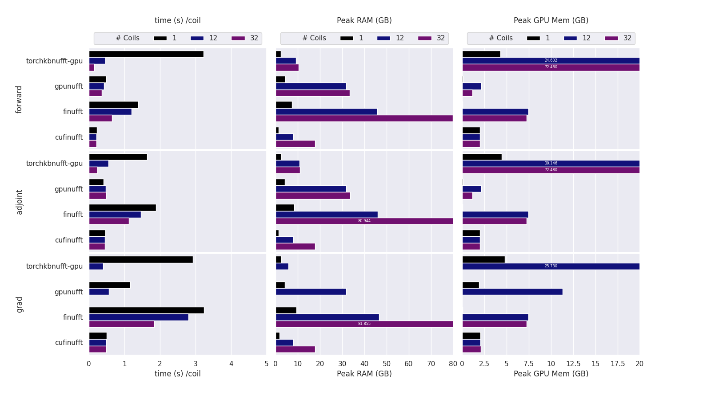
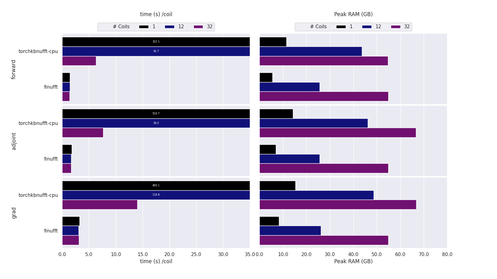
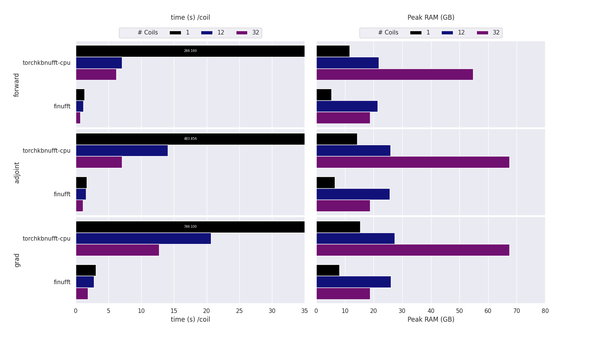

# Benchmark of MRI-NUFFT 

This are a collection of script to perform benchmarking of MRI-NUFFT operations. 

They rely on the hydra configuration package and hydra-callback for measuring statistics. (see `requirements.txt`)

To fully reproduce the  benchmarks 4 steps are necessary: 

0. Get a Cartesian Reference image file, name `cpx_cartesian.npy`  
   You can use `python 05_create_data.py`  
1. Generates the trajectory files  
   If you want a 2D traj, you can use  `python 00_trajectory2D.py` + shape of your data  
   Elif a 3D traj , `python 00_trajectory3D.py` + shape of your data  
2. Run the benchmarks. Currently are available:   
 - The Performance benchmark, checking the CPU/GPU usage and memory footprint for the different backend and configuration `perf` folder.  
    You can use `python 10_benchmark_perf.py` for you perf analysis.  
    You can change some parameters like :  
    `python 10_benchmark_perf.py data.n_coils=32 backend.name=cufinufft`  
    You can also do multirun like :  
    `python 10_benchmark_perf.py -m data.n_coils=1,12,32 backend.name=cufinufft,finufft trajectory=./trajs/radial_256x256_0.5.bin,./trajs/stack2D_of_spiral_256x256_0.5.bin `  

    For running on Jean Zay, follow [this step](https://github.com/zaccharieramzi/jz-hydra-submitit-launcher) for the installation.
    Then you can run : 
    `hydra-submitit-launch 10_benchmark_perf.py dev max_time=5.0 data.n_coils=1,12,32 trajectory=./radial_256x256_0.5.bin,./stack2D_of_spiral_256x256_0.5.bin backend.name=tensorflow `  
     
    In every case don't forget to install the necessary dependencies for each backend.  
 - The Quality benchmark that check how the pair trajectory/backend performs for the reconstruction. All the configuration is modifiable in `qual` folder.  
    To launch the quality benchmark run `python 20_benchmark_quality.py`   
3. Generate some analysis figures using `python 30_perf_analysis.py` + path to the folder with all .csv + trajectory dimension use (2 or 3) + title of the figures we gonna save.  

## Some results : 
# Benchmark backend performance on 2D images and trajs.

On cuda11 : 

On cuda12, with the new version on (cu)finufft 2.3 install with pip : 

On cuda12, with the new version on (cu)finufft 2.3 install with 'pip install --no-binary finufft finufft' : 

# Benchmark for GPU backend performance on 3D images and trajs.

On cuda11 :

On cuda12, with the new version on (cu)finufft 2.3 install with pip : 

On cuda12, with the new version on (cu)finufft 2.3 install with 'pip install --no-binary finufft finufft' : 

# Benchmark for CPU backend performance on 3D images and trajs.

On cuda11 :

On cuda12, with the new version on (cu)finufft 2.3 install with pip : 

