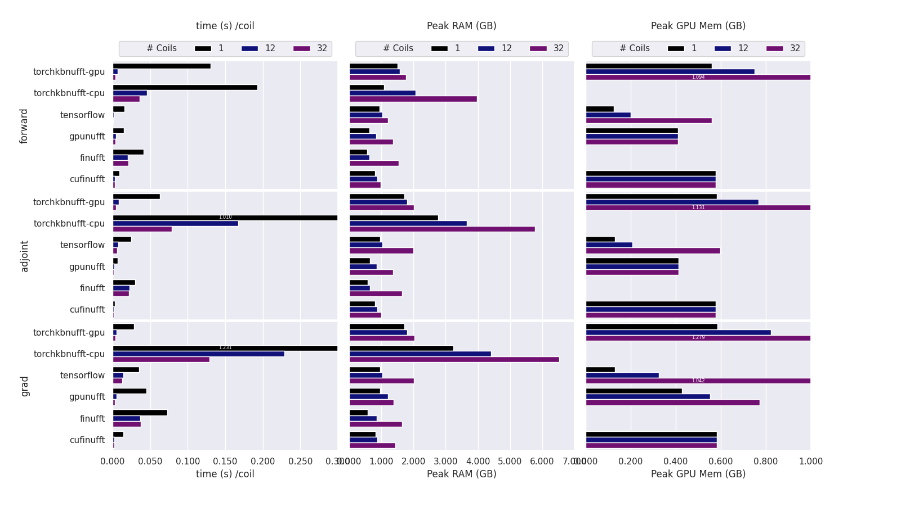
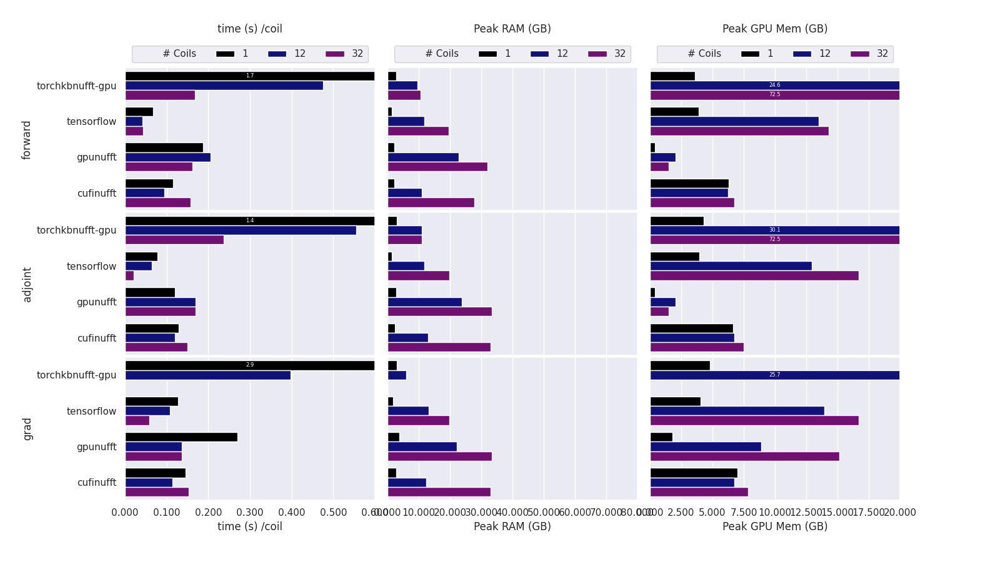

# Benchmark of MRI-NUFFT 

This are a collection of script to perform benchmarking of MRI-NUFFT operations. 

They rely on the hydra configuration package and hydra-callback for measuring statistics. (see `requirements.txt`)

To fully reproduce the  benchmarks 4 steps are necessary: 

0. Get a Cartesian Reference image file, name `cpx_cartesian.npy`
   You can use `python 0_create_data.py`
1. Generates the trajectory files
   If you want a 2D traj, you can use  `python 00_trajectory2D.py` + shape of your data
   Elif a 3D traj , `python 00_trajectory3D.py` + shape of your data
2. Run the benchmarks. Currently are available: 
 - The Performance benchmark, checking the CPU/GPU usage and memory footprint for the different backend and configuration `perf` folder.
    If you have a configuration for 1 backend, 1 traj and 1 coil you can use `python 10_benchmark_perf.py` for you perf analysis.
    If you want to make several benchamrk in a row, you can run `python 50_auto_benchmark_perf.py` 
    Backends, trajectories and coils can be managed directly at the start of the script 
    
    In evry case don't forget to install the necessary dependencies for each backend
 - The Quality benchmark that check how the pair trajectory/backend performs for the reconstruction. in `qual` folder
3. Generate some analysis figures using `perf_analysis.py` + title of the figures
   At the start of the script, you need to indicate which folder the performance files are in. 
   Caution: to get beautiful graphs, you'll probably have to change the plot parameters (bar colors, abscissa max, number of digits after the decimal point, text size on the plots, etc.).

This is some result : 
Benchmark backend performance on 2D images and trajs.

Benchmark for GPU backend performance on 3D images and trajs.

Benchmark for CPU backend performance on 3D images and trajs.
